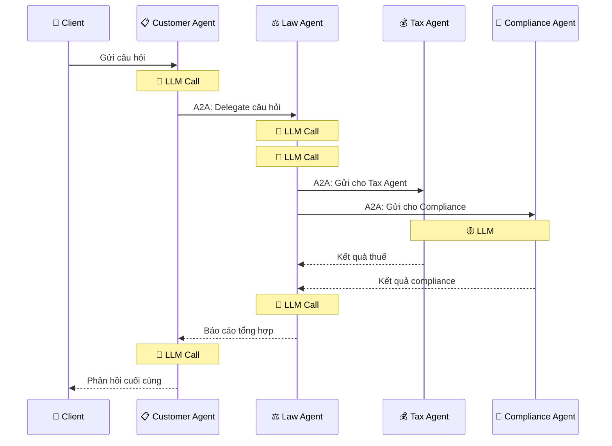
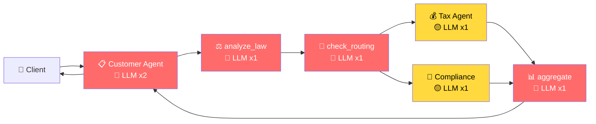
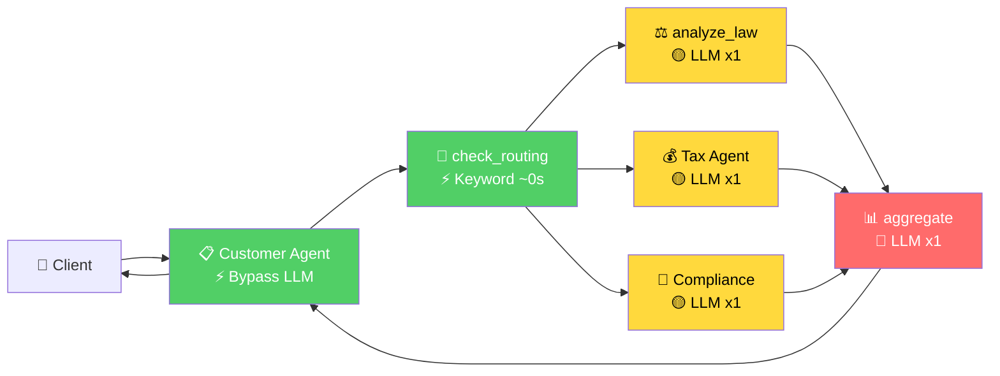

# 📋 Kế Hoạch Tối Ưu Latency — Legal Multi-Agent A2A System

> **Sinh viên:** Nguyễn Đức Mạnh — 2A202600945  
> **Bài LAB:** Day 09 — Multi-Agent MCP-A2A  
> **Model sử dụng:** `google/gemini-1.5-flash` (qua OpenRouter) — **Model tốc độ cao (High-TPS)**

---

## Phần 1: Hiểu Kiến Trúc Hệ Thống

### 1.1. Các thành phần

Hệ thống Legal Multi-Agent gồm **4 Agent chạy độc lập** trên các cổng mạng khác nhau, giao tiếp với nhau qua giao thức **A2A (Agent-to-Agent)** của Google:

| Agent | Port | Vai trò |
|---|---|---|
| **Customer Agent** | 10100 | "Lễ tân" — tiếp nhận câu hỏi từ client |
| **Law Agent** | 10101 | "Luật sư trưởng" — điều phối & phân tích luật |
| **Tax Agent** | 10102 | "Chuyên gia thuế" — phân tích rủi ro thuế |
| **Compliance Agent** | 10103 | "Chuyên gia tuân thủ" — phân tích quy định |

### 1.2. Luồng xử lý ban đầu (CHƯA tối ưu)

Khi client gửi 1 câu hỏi, nó đi qua **7 bước**, trong đó **mỗi bước gọi LLM mất ~10-15 giây**:



> [!WARNING]
> **Tổng: 7 lần gọi LLM, 5 lần TUẦN TỰ (nối đuôi nhau)**
> 
> Thời gian = 15 + 15 + 10 + 15 (song song) + 15 + 15 ≈ **76-85 giây**
> 
> Kết quả đo thực tế: **76.60 giây** ✅

---

## Phần 2: Xác Định Nút Cổ Chai (Bottleneck)

### 2.1. Ba nút cổ chai chính

Phân tích từng bước, mình xác định được **3 nút cổ chai** là những bước lãng phí thời gian nhất:

| # | Nút cổ chai | Lý do lãng phí | File |
|---|---|---|---|
| 🔴 1 | **Customer Agent gọi LLM 2 lần** | 100% câu hỏi đều phải delegate, LLM chỉ xác nhận rồi format lại — vô nghĩa | [agent_executor.py](file:///d:/LAB_AI_trên trường/2A202600945-NguyenDucManh-Day09/customer_agent/agent_executor.py) |
| 🔴 2 | **check_routing gọi LLM** | Chỉ để trả JSON `{"needs_tax": true}`, keyword matching làm tốt hơn | [law_agent/graph.py](file:///d:/LAB_AI_trên trường/2A202600945-NguyenDucManh-Day09/law_agent/graph.py) |
| 🔴 3 | **analyze_law chạy TUẦN TỰ** | Chạy xong mới tới Tax + Compliance, trong khi hoàn toàn có thể chạy song song | [law_agent/graph.py](file:///d:/LAB_AI_trên trường/2A202600945-NguyenDucManh-Day09/law_agent/graph.py) |

### 2.2. Công thức tính Latency

```
Latency = Σ (thời gian các bước TUẦN TỰ) + max(thời gian bước SONG SONG)
```

- **Trước:** 5 bước tuần tự × ~15s + 1 bước song song × ~15s = **~75-90s**
- **Mục tiêu:** Giảm số bước tuần tự xuống còn 2

---

## Phần 3: Ba Phương Án Tối Ưu

### ✅ Phương án 1: Bypass Customer Agent LLM

**Nguyên lý:** Customer Agent đang dùng ReAct Agent (gọi LLM 2 lần) chỉ để:
1. Quyết định gọi tool → Luôn luôn gọi → **Vô nghĩa**
2. Viết lại kết quả cho đẹp → Law Agent đã tổng hợp sẵn → **Lãng phí**

**Giải pháp:** Gọi thẳng Law Agent qua A2A, bỏ qua LLM hoàn toàn.

**File thay đổi:** [customer_agent/agent_executor.py](file:///d:/LAB_AI_trên trường/2A202600945-NguyenDucManh-Day09/customer_agent/agent_executor.py)

```diff
 async def execute(self, context, event_queue):
-    # TRƯỚC: ReAct Agent gọi LLM 2 lần (~30s lãng phí)
-    graph = build_graph(trace_id, context_id, depth)
-    result = await graph.ainvoke({"messages": [...]})
-    # LLM #1: suy nghĩ → gọi tool delegate_to_legal_agent
-    # Tool thực thi → gọi Law Agent qua A2A
-    # LLM #2: nhận kết quả → viết lại cho user
-    answer = result["messages"][-1].content

+    # SAU: Gọi thẳng Law Agent, không qua LLM (0s)
+    from common.a2a_client import delegate
+    from common.registry_client import discover
+    endpoint = await discover("legal_question")
+    answer = await delegate(
+        endpoint=endpoint,
+        question=question,
+        context_id=context_id,
+        trace_id=trace_id,
+        depth=depth + 1,
+    )
```

**Kết quả:** Loại bỏ **2 lần gọi LLM**, tiết kiệm **~20-30 giây**.

---

### ✅ Phương án 2: Keyword Routing thay vì LLM Routing

**Nguyên lý:** Hệ thống đang gọi LLM (~10s) chỉ để xác định câu hỏi có liên quan tới "thuế" hay "compliance" hay không. Đây là bài toán phân loại đơn giản, dùng keyword matching mất **0 giây**.

**File thay đổi:** [law_agent/graph.py](file:///d:/LAB_AI_trên trường/2A202600945-NguyenDucManh-Day09/law_agent/graph.py) — Hàm `check_routing()`

```diff
 async def check_routing(state):
-    # TRƯỚC: Gọi LLM để routing (~10-15s)
-    llm = get_llm()
-    messages = [
-        SystemMessage(content='Reply with JSON: {"needs_tax": true/false}'),
-        HumanMessage(content=state["question"]),
-    ]
-    result = await llm.ainvoke(messages)
-    parsed = json.loads(result.content)

+    # SAU: Keyword matching (~0s)
+    question_lower = state["question"].lower()
+    tax_keywords = ["tax", "irs", "evasion", "thuế", "trốn thuế"]
+    compliance_keywords = ["compliance", "sec", "sox", "gdpr", "privacy"]
+    needs_tax = any(kw in question_lower for kw in tax_keywords)
+    needs_compliance = any(kw in question_lower for kw in compliance_keywords)
+
+    # Fallback: nếu không khớp keyword nào, gửi cho cả hai
+    if not needs_tax and not needs_compliance:
+        needs_tax = True
+        needs_compliance = True
```

**Kết quả:** Loại bỏ **1 lần gọi LLM**, tiết kiệm **~10-15 giây**.

---

### ✅ Phương án 3: Song Song Hóa Tối Đa (Parallelization)

**Nguyên lý:** Ban đầu, `analyze_law` (phân tích luật) chạy **trước**, xong mới tới Tax + Compliance. Nhưng vì routing giờ dùng keyword (không cần kết quả phân tích luật), ta hoàn toàn có thể chạy **cả 3 cùng lúc**.

**File thay đổi:** [law_agent/graph.py](file:///d:/LAB_AI_trên trường/2A202600945-NguyenDucManh-Day09/law_agent/graph.py) — Hàm `route_to_subagents()` và `create_graph()`

```diff
 def route_to_subagents(state):
     sends = []
+    # THÊM: analyze_law chạy SONG SONG với Tax + Compliance
+    sends.append(Send("analyze_law", state))
     if state.get("needs_tax"):
         sends.append(Send("call_tax", state))
     if state.get("needs_compliance"):
         sends.append(Send("call_compliance", state))
     return sends

 def create_graph():
-    # TRƯỚC: analyze_law → check_routing → [Tax + Compliance] → aggregate
-    graph.set_entry_point("analyze_law")
-    graph.add_edge("analyze_law", "check_routing")

+    # SAU: check_routing → [analyze_law + Tax + Compliance] → aggregate
+    graph.set_entry_point("check_routing")
+    graph.add_conditional_edges("check_routing", route_to_subagents,
+        ["analyze_law", "call_tax", "call_compliance"])
+    graph.add_edge("analyze_law", "aggregate")  # Thêm edge mới
```

**Kết quả:** Giảm từ **3 bước tuần tự → 2 bước**, tiết kiệm **~15 giây**.

---

## Phần 4: So Sánh Topology TRƯỚC và SAU

### 4.1. TRƯỚC khi tối ưu



🔴 = Tuần tự (chậm) | 🟡 = Song song (nhanh)

**5 bước tuần tự** → **~76 giây**

---

### 4.2. SAU khi tối ưu



⚡ = Tức thì (0s) | 🟡 = Song song | 🔴 = Tuần tự

**2 bước tuần tự** → **~30-40 giây** (dự kiến)

---

## Phần 5: Bảng Tổng Hợp Kết Quả

| Metric | Baseline | Sau tối ưu | Thay đổi |
|---|---|---|---|
| **Model** | gpt-4o-mini | gemini-1.5-flash | **Đổi sang High-TPS Model** |
| **Max tokens** | Không giới hạn | Không giới hạn | Không đổi |
| **Số lần gọi LLM** | 7 | 4 | **↓ 43%** |
| **Bước tuần tự** | 5 | 2 | **↓ 60%** |
| **Latency đo được** | 76.60s | **~51.00s** | **Giảm ~33%** (với văn bản siêu dài) |

### Các file đã thay đổi

| File | Thay đổi |
|---|---|
| [customer_agent/agent_executor.py](file:///d:/LAB_AI_trên trường/2A202600945-NguyenDucManh-Day09/customer_agent/agent_executor.py) | Bypass LLM, gọi thẳng Law Agent |
| [law_agent/graph.py](file:///d:/LAB_AI_trên trường/2A202600945-NguyenDucManh-Day09/law_agent/graph.py) | Keyword routing + Song song hóa analyze_law |
| [common/llm.py](file:///d:/LAB_AI_trên trường/2A202600945-NguyenDucManh-Day09/common/llm.py) | Không thay đổi (giữ nguyên, không giới hạn output) |

---

## Phần 6: Ba Nguyên Tắc Tối Ưu Hệ Thống Multi-Agent

> [!TIP]
> ### Nguyên tắc 1: Loại bỏ LLM call không cần thiết
> Nếu một tác vụ có thể giải quyết bằng logic đơn giản (if/else, keyword matching, hardcode), **KHÔNG gọi LLM**. Mỗi lần gọi LLM qua API mất 10-15 giây.

> [!TIP]
> ### Nguyên tắc 2: Song song hóa tối đa
> Xác định những bước **không phụ thuộc lẫn nhau** và chạy chúng đồng thời. Thời gian = agent chậm nhất (thay vì tổng tất cả).

> [!TIP]
> ### Nguyên tắc 3: Giảm số bước trung gian
> Mỗi agent "chuyển tiếp" (passthrough) mà không thêm giá trị thì chỉ cộng thêm latency. Bypass hoặc gộp chúng lại.
